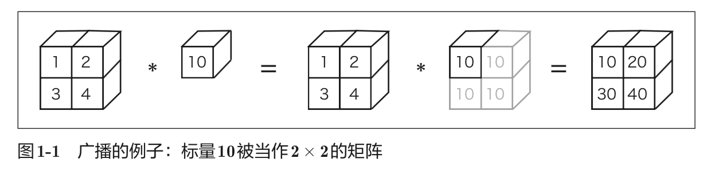
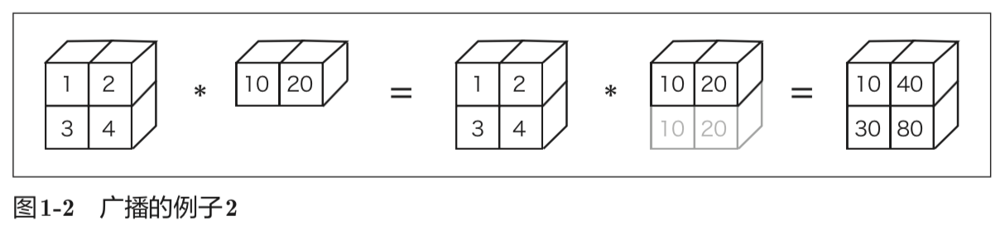
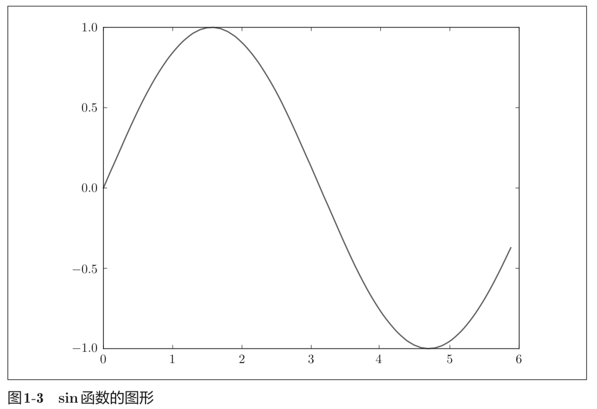

今天阅读的是《深度学习入门：基于Python的理论与实现》第0-19页部分，主要介绍了Python的知识和相应的库的使用。

## Python基础知识

### Python

Python 是一个简单、易读、易记的编程语言，而且是开源的，可以免费地自由使用。Python 可以用类似英语的语法编写程序，编译起来也不费力，因此我们可以很轻松地使用 Python。

### 版本的区别

Python有Python 2.x和Python 3.x两个版本。因此，在安装 Python 时，需要慎重选择安装 Python 的哪个版本。这是因为两个版本之间没有向后兼容性。


### NumPy和Matplotlib库

NumPy 是用于数值计算的库，提供了很多高级的数学算法和便利的数组(矩阵)操作方法。本书中将使用这些便利的方法来有效地促进深度学习的实现。

Matplotlib 是用来画图的库。使用 Matplotlib 能将实验结果可视化，并在视觉上确认深度学习运行期间的数据。

## Python的使用

### 查看Python版本

安装好Python3后，打开终端，输入`python3 --version`即可查询到当前安装的python版本：

```sh
> python3 --version
Python 3.7.1
```

在官网安装的Python2.7和Python3.7在终端访问的方式略有不同：

- Python2 : python --version
- Python3 : python3 --version (Windows环境为py --version)

### Python 解释器

Python 解释器也被称为“对话模式”，用户能够以和 Python 对话的方式进行编程。比如，当用户询问“1 + 2 等于几?”的时候，Python 解释器会回答“3”，所谓对话模式，就是指这样的交互：

```shell
> python3
Python 3.7.1 (v3.7.1:260ec2c36a, Oct 20 2018, 03:13:28)
[Clang 6.0 (clang-600.0.57)] on darwin
Type "help", "copyright", "credits" or "license" for more information.
>>> 1+2
3
>>>
```
### 算数计算

*表示乘法，/表示除法，\*\*表示乘方(3\*\*2是3的2次方)。这部分跟大部分的编程语言类似，但是也使用了\*\*这样的在Java中没见过的语法糖

```shell
>>> 1+2
3
>>> 1-2
-1
>>> 4*5
20
>>> 7/5
1.4
>>> 3**2
9
>>>
```

### 数据类型

Python编程中有数据类型(data type)这一概念。数据类型表示数据的性质，有整数、小数、字符串等类型。Python 中的 type() 函数可以用来查看数据 类型。

```shell
>>> type(10)
<class 'int'>
>>> type(2.718)
<class 'float'>
>>> type('abc')
<class 'str'>
>>>
```


### 变量

可以使用 x 或 y 等字母定义变量(variable)。此外，可以使用变量进行计算，也可以对变量赋值。
> 注：python2.7的打印方式为 `print x`

```shell
>>> x=10
>>> print(x)
10
>>>
```

Python 是属于“动态类型语言”的编程语言，所谓动态，是指变量的类型是根据情况自动决定的。在上面的例子中，用户并没有明确指出“x 的类型是 int(整型)”，是 Python 根据 x 被初始化为 10，从而判断出 x 的类型为int 的。此外，我们也可以看到，整数和小数相乘的结果是小数(数据类型的自动转换)。

另外，“#”是注释的意思，它后面的文字会被 Python 忽略。

### 列表

#### 创建和打印列表

```python
>>> a = [1, 2, 3, 4, 99] # 生成列表
>>> print(a)
[1, 2, 3, 4, 99]
>>>
```

#### 切片访问

Python 的列表提供了切片 (slicing)这一便捷的标记法。使用切片不仅可以访问某个值，还可以访问列表的子列表(部分列表)。

进行列表的切片时，需要写成 a[0:2] 这样的形式。a[0:2] 用于取出从索引为 0 的元素到索引为 2 的元素的前一个元素之间的元素。另外，索引 −1 对应最后一个元素，−2 对应最后一个元素的前一个元素。

```python
>>> a[0:2] # 获取索引为0到2(不包括2!)的元素 [1, 2]
>>> a[1:] # 获取从索引为 1 的元素到最后一个元素 [2, 3, 4, 99]
>>> a[:3] # 获取从第一个元素到索引为 3(不包括 3 !)的元素
[1, 2, 3]
>>> a[:-1] # 获取从第一个元素到最后一个元素的前一个元素之间的元素 [1, 2, 3, 4]
>>> a[:-2] # 获取从第一个元素到最后一个元素的前二个元素之间的元素 [1, 2, 3]
>>>
```

### 字典

Python字典类似Java中的Map结构，也就是Json格式中的Key:value结构：

```python
>>> me = {'height':180} # 生成字典
>>> me['height'] # 访问元素 180
>>> me['weight'] = 70 # 添加新元素
>>> print(me)
{'height': 180, 'weight': 70}
```

### 布尔型

布尔型则比较好理解，类似Java中的Boolean类型，但是Python中的判断更加像平时说话的方式，用`and`替代`&&`，用`or`替代`||`，使代码可读性大大加强：

```python
>>> hungry = True # 饿了?
>>> sleepy = False # 困了?
>>> type(hungry)
<class 'bool'>
>>> not hungry
False
>>> hungry and sleepy # 饿并且困 False
>>> hungry or sleepy # 饿或者困 True
```


### If 语句

Python中的空白字符具有重要的意义。上面的if语句中，if hungry:下面的语句开头有4个空白字符。它是缩进的意思，表示当前面的条件(if hungry)成立时，此处的代码会被执行。这个缩进也可以用 tab 表示，Python 中推荐使用空白字符。

也就是说，Python使用缩进代替了Java中的`{`、`}`来对代码进行分块。同时强烈建议使用四空格代替`\t`来进行缩进，这样在Win平台和Linux平台显示的缩进就会相同，而不会出现格式乱掉的情况。

```python
>>> hungry = True
>>> if hungry:
...     print("I'm hungry")
...
I'm hungry
>>>
```


### For 语句

for...in...更加符合平时的阅读习惯：

```python
>>> for i in [1, 2, 3]:
...     print(i)
...
1
2
3
>>>
```


### 函数

可以将一连串的处理定义成函数(function)：

```python
>>> def hello():
...     print("hello world")
...
>>> hello()
hello world
>>>
```

由于是动态类型语言，所以不需要指定返回值类型。


### 退出对话模式

关闭Python解释器时，Linux或Mac OS X的情况下输入Ctrl-D(按住Ctrl，再按 D 键);Windows 的情况下输入 Ctrl-Z，然后按 Enter 键。当然我更喜欢在对话框中输入`exit()`来退出：

```python
>>> exit()
>
```


## Python 脚本文件

可以将Python 程序保存为文件，然后(集中地)运行这个文件，文件后续名为`.py`。
使用方式为在终端中输入 `python3 filename.py` 即可执行Python脚本文件，非常方便。

## 类

Python 中使用 class 关键字来定义类，类要遵循下述格式(模板)：

```python
class 类名:
    def __init__(self, 参数, ...): # 构造函数
    	...
    def 方法名1(self, 参数, ...): # 方法1
    	...
    def 方法名2(self, 参数, ...): # 方法2
    	...
```

这里有一个特殊的 __init__ 方法，这是进行初始化的方法，也称为构造函数(constructor), 只在生成类的实例时被调用一次。此外，在方法的第一个参数中明确地写入表示自身(自身的实例)的 self 是 Python 的一个特点。


## NumPy

在深度学习的实现中，经常出现数组和矩阵的计算。NumPy 的数组类 (numpy.array)中提供了很多便捷的方法

### 使用Numpy

#### 基本运算


```shell
>>> import numpy as np
>>> x = np.array([1.0, 2.0, 3.0]) >>> print(x)
[ 1. 2. 3.]
>>> type(x)
<class 'numpy.ndarray'>
```

>  如果出现`ModuleNotFoundError: No module named 'numpy'`则需要使用pip安装Numpy
>
> ```shell
> pip3 install numpy
> ```
>
> 安装完成后即可使用

NumPy 数组的算术运算：

```shell
>>> y = np.array([2.0, 3.0, 4.0])
>>> x+y
array([3., 5., 7.])
>>>
```

如果元素个数不同，程序就会报错，所以元素个数保持一致非常重要。“对应元素的”的英文是 element-wise，比如“对应元素的乘法”就是element-wise product。

生成多维数组

```shell
>>> A = np.array([[1, 2], [3, 4]])
```

矩阵运算

```shell
>>> B = np.array([[3, 0],[0, 6]])
>>> A + B
array([[ 4, 2],
	  [ 3, 10]])
>>> A * 10
array([[ 10, 20],
	  [ 30, 40]])
```

#### 广播

NumPy 中，形状不同的数组之间也可以进行运算。之前的例子中，在2×2 的矩阵 A 和标量 10 之间进行了乘法运算。在这个过程中，如图 1-1 所示，标量 10 被扩展成了 2 × 2 的形状，然后再与矩阵 A 进行乘法运算。这个巧妙的功能称为广播(broadcast)。





#### 访问元素

```shell
>>> X[0][1] # (0,1)的元素
或者
>>> for row in X:
...		print(row)
```


## Matplotlib

在深度学习的实验中，图形的绘制和数据的可视化非常重要。Matplotlib 是用于绘制图形的库，使用 Matplotlib 可以轻松地绘制图形和实现数据的可视化。

### 绘制简单图形

```python
import numpy as np
import matplotlib.pyplot as plt
# 生成数据
x = np.arange(0, 6, 0.1) # 以0.1为单位，生成0到6的数据
y = np.sin(x)
plt.plot(x, y)
plt.show()
```

这里使用NumPy的arange方法生成了[0, 0.1, 0.2, ..., 5.8, 5.9]的数据，将其设为 x。对 x 的各个元素，应用 NumPy 的 sin 函数 np.sin()，将 x、y 的数据传给 plt.plot 方法，然后绘制图形。最后，通过 plt.show() 显示图形。运行上述代码后，就会显示图 1-3 所示的图形：




### 显示图像

pyplot中还提供了用于显示图像的方法imshow()。另外，可以使用matplotlib.image 模块的 imread() 方法读入图像。

```python
import matplotlib.pyplot as plt
from matplotlib.image import imread

img = imread('lena.png') # 读入图像(设定合适的路径!)
plt.imshow(img)

plt.show()
```
