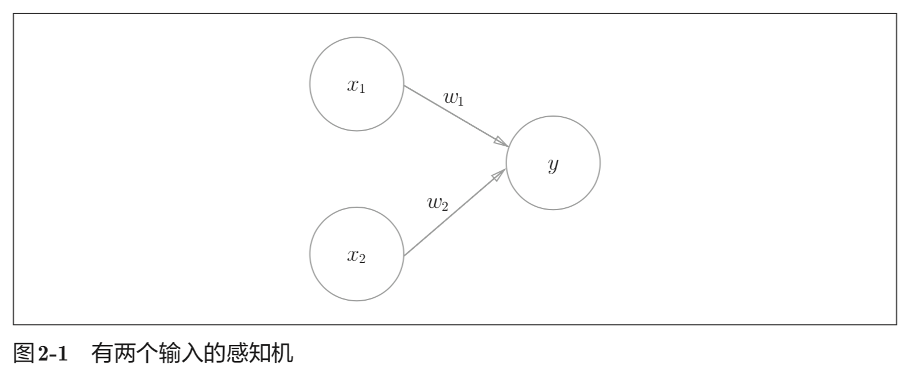
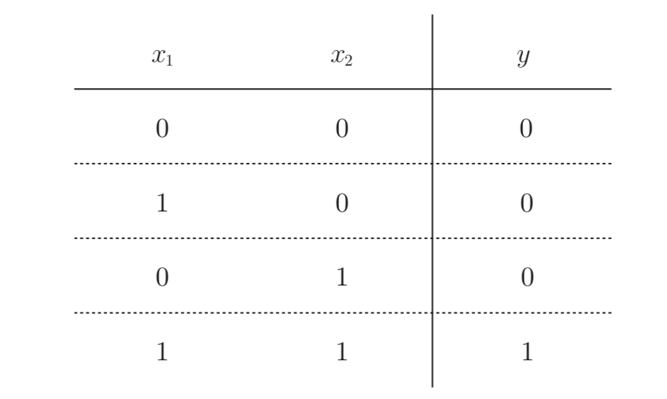
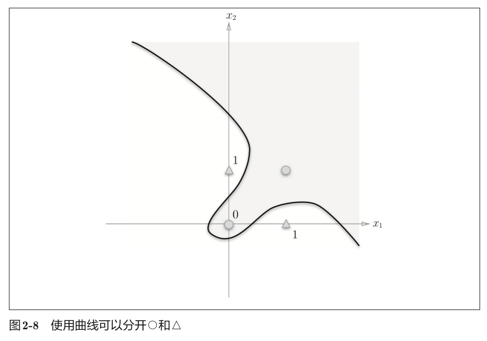
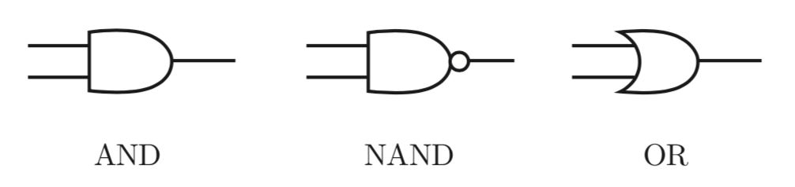
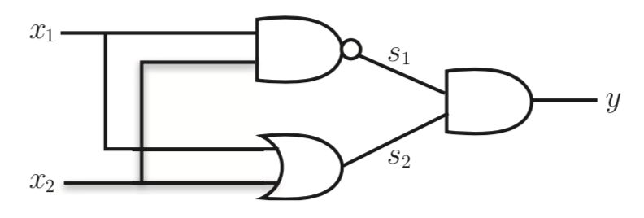

今天学习了第二章：感知机。

## 感知机是什么

感知机(perceptron)这一算法是由美国学者 Frank Rosenblatt 在 1957 年提出来的。感知机接收多个输入信号，输出一个信号。这里所说的“信号”可以想 象成电流或河流那样具备“流动性”的东西。像电流流过导线，向前方输送 电子一样，感知机的信号也会形成流，向前方输送信息。但是，和实际的电 流不同的是，感知机的信号只有“流 / 不流”(1/0)两种取值。在本书中，0 对应“不传递信号”，1 对应“传递信号”。

x1、x2 是输入信号， y是输出信号，w1、w2 是权重(w是weight的首字母)。图中的○称为“神 经元”或者“节点”。输入信号被送往神经元时，会被分别乘以固定的权重(w1x1、w2x2)。神经元会计算传送过来的信号的总和，只有当这个总和超过 了某个界限值时，才会输出1。这也称为“神经元被激活”。这里将这个界 限值称为阈值，用符号 θ 表示。



把上述内容用数学式来表示，就是式(2.1)：

$$
y=\begin{cases}
0 & (w_1x_1+w_2x_2) \leqslant \theta\\
1 & (w_1x_1+w_2x_2) > \theta
\end{cases}\tag{2.1}\label{l2.1}
$$

感知机的多个输入信号都有各自固有的权重，这些权重发挥着控制各个 信号的重要性的作用。也就是说，权重越大，对应该权重的信号的重要性就越高。

## 感知机实现与门电路

### 与门

#### 方案



选择方法有无数多个。比如，当(w1, w2, θ) = (0.5, 0.5, 0.7) 时，可 以 满 足 图 2-2 的 条 件。此 外，当 (w1, w2, θ)为 (0.5, 0.5, 0.8) 或者 (1.0, 1.0, 1.0) 时，同样也满足与门的条件。设定这样的参数后，仅当 x1 和 x2 同时为 1 时，信号的加权总和才会超过给定的阈值 θ。

#### 实现

```python
def AND(x1, x2):
    w1, w2, theta = 0.5, 0.5, 0.7 
    tmp = x1*w1 + x2*w2
    if tmp <= theta:
        return 0
    elif tmp > theta:
        return 1
```

结果：

```python
AND(0, 0) # 输出0 
AND(1, 0) # 输出0 
AND(0, 1) # 输出0 
AND(1, 1) # 输出1
```


## 导入权重和偏置

式(2.1)的θ换成−b，于是就可以用式(2.2)来表示感知机的行为：


$$
y=\begin{cases}
0 & (b+w_1x_1+w_2x_2) \leqslant 0\\
1 & (b+w_1x_1+w_2x_2) > 0
\end{cases}\tag{2.2}\label{l2.2}
$$

此处，b 称为偏置，w1 和 w2 称为权重。如式(2.2)所示，感知机会计算输入信号和权重的乘积，然后加上偏置，如果这个值大于 0 则输出 1，否则输出 0。下面，我们使用 NumPy，按式(2.2)的方式实现感知机：

```python
def AND(x1, x2):
    x = np.array([x1, x2]) # 输入信号
    w = np.array([0.5, 0.5]) # 权重
    b = -0.7 # 偏置
    tmp = np.sum(w*x) + b # 计算
    if tmp <= 0:
        return 0 
    else:
        return 1
```

这里把 −θ 命名为偏置 b，但是请注意，偏置和权重 w1、w2 的作用是不一样的。具体地说，w1 和 w2 是控制输入信号的重要性的参数，而偏置是调整神经元被激活的容易程度(输出信号为 1 的程度)的参数。比如，若 b 为−0.1，则只要输入信号的加权总和超过 0.1，神经元就会被激活。但是如果 b为 −20.0，则输入信号的加权总和必须超过 20.0，神经元才会被激活。像这样，偏置的值决定了神经元被激活的容易程度。另外，这里我们将 w1 和 w2 称为权重，将 b 称为偏置，但是根据上下文，有时也会将 b、w1、w2 这些参数统称为权重。


## 实现与非门和或门

### 与非门

```python
def NAND(x1, x2):
    x = np.array([x1, x2])
    w = np.array([-0.5, -0.5]) # 仅权重和偏置与AND不同! 
    b = 0.7
    tmp = np.sum(w*x) + b
    if tmp <= 0:
        return 0 
    else:
        return 1
```

### 或门

```python
def OR(X1, X2):
    x = np.array([x1, x2])
    w = np.array([0.5, 0.5])
    b = -0.2
    tmp = np.sum(w*x) + b
    if tmp <= 0:
        return 0
    else
        return 1
```

## 感知机的局限性

因为感知机是线性空间，所以单层感知机无法实现`异或门(XOR gate)`。

### 线性和非线性

由图 2-8 这样的曲线分割而成的空间称为`非线性空间`，由直线分割而成的空间称为`线性空间`。




## 多层感知机

我们可以使用如下结构来实现异或门：





异或门是一种多层结构的神经网络。这里，将最左边的 一列称为第 0 层，中间的一列称为第 1 层，最右边的一列称为第 2 层。图所示的感知机与前面介绍的与门、或门的感知机(图 2-1)形状不同。实际上，与门、或门是单层感知机，而异或门是 2 层感知机。叠加了多层的感知机也称为多层感知机(multi-layered perceptron)。

这种 2 层感知机的运行过程可以比作流水线的组装作业。第 1 段(第 1 层) 的工人对传送过来的零件进行加工，完成后再传送给第 2 段(第 2 层)的工人。 第 2 层的工人对第 1 层的工人传过来的零件进行加工，完成这个零件后出货 (输出)。 像这样，在异或门的感知机中，工人之间不断进行零件的传送。通过这样的结构 ( 2层结构 )， 感知机得以实现异或门 。 这可以解释为 “ 单层感知机无法表示的东西，通过增加一层就可以解决”。也就是说，通过叠加层(加深 层)，感知机能进行更加灵活的表示。 


## 小结

- 感知机是具有输入和输出的算法。给定一个输入后，将输出一个既定的值。

- 感知机将权重和偏置设定为参数。

- 使用感知机可以表示与门和或门等逻辑电路。

- 异或门无法通过单层感知机来表示。

- 使用2层感知机可以表示异或门。

- 单层感知机只能表示线性空间，而多层感知机可以表示非线性空间。

- 多层感知机(在理论上)可以表示计算机。

