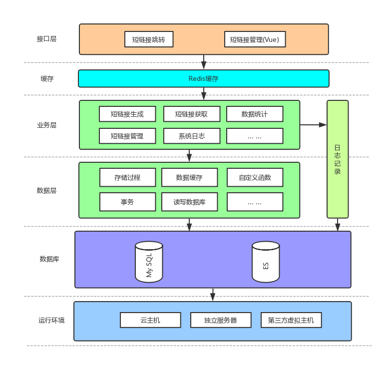
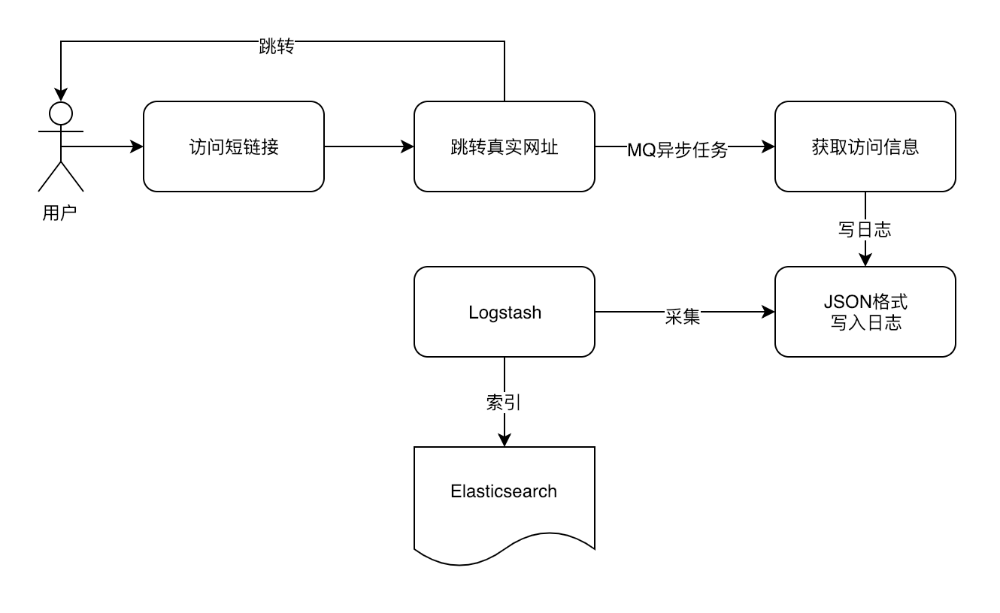
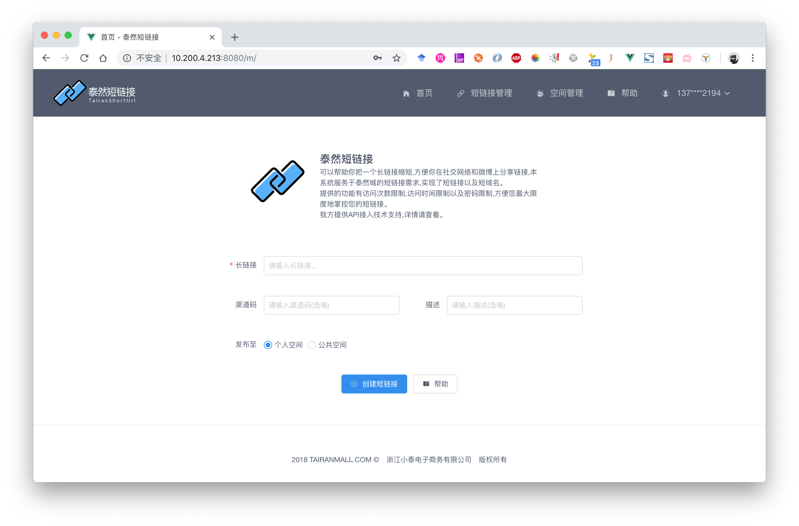
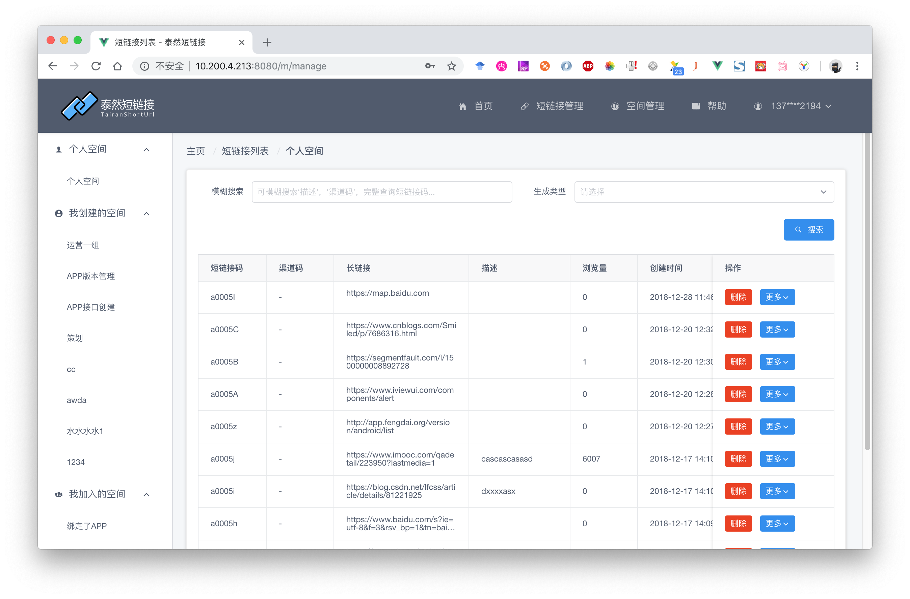
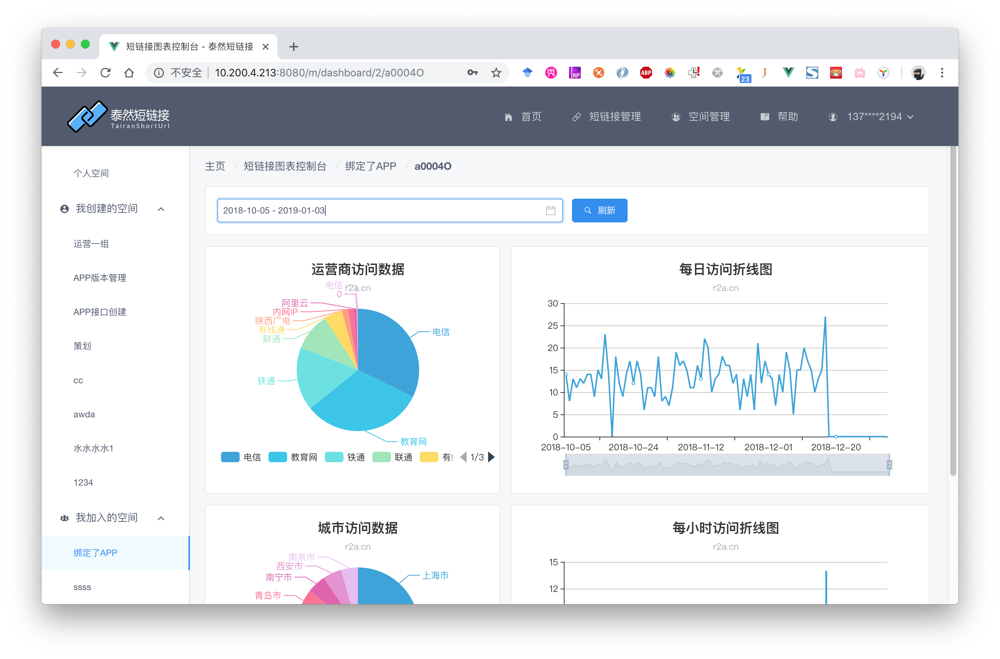

在日常生活中，我们经常需要用到短链接、短网址服务，将长链接映射为短链接，更方便该路径在互联网，短信，海报等载体中传播，在运营和销售的场景下，还可以帮助工作人员统计业绩，用处非常大。

市面上比较常见的短链接有：新浪的t.cn、淘宝的tb.am、0x3.me（数据统计报表）。作为一个数据控，我更喜欢0x3.me这样的提供一整套数据报表的短网址服务，更为专业，短链接系统的价值也体现越大。

## 原理

短链接的保存可以采用62进制法，在数据库中，使用 `十进制` 的ID保存每一条长链接，例如：

| ID(十进制) | URL                   | ID的62进制 |
| ---- | --------------------- | ---- |
| 1    | https://baidu.com | 000001 |
| 2    | https://jd.com?a=1&b=c | 000002 |
| 3    | https://taobao.com/ccc/ddd/eee | 000003 |
| ... | ... | ... |
| 9326778807 | https://qq.com | abcdef |

我们将十进制的ID转换为62进制，即可得到一个短链接的Code。一个六位的Code由`0-9a-zA-Z`组成，总共的组合超过500亿条，显然可以满足大部分的短链接需求。

假设我们的短链接网址的域名是`x.com`，那么我们的短链接地址就是`x.com/abcdef`，我们写好后台程序，当请求进来时，我们从数据库中找到对应的长链接，使用301或者302跳转，将长链接提供给访问者，即可实现一个短链接跳转的功能。

## 设计

基本的原理搞清楚了，我们开始设计短链接系统，想要设计一个高性能的短链接系统，首先要确定该系统的架构，这次我们选用了Java来开发后端，MySQL作存储，前端使用Vue来进行前后端分离。当前各大企业最流行的开发的结构。在日志收集和分析的模块，我们使用ELK架构，分析每一次访问的数据，包括IP，访问地域，访问操作系统等信息，存储在ElasticSearch中，在数据和图标展示模块，我们使用ES的聚合函数进行数据聚合，并使用Echarts进行展示。

**架构图**

根据上述设计，我们可以画出一个短链接系统的架构图：



架构设计好后我们开始进行编码


## 表结构设计

首先设计短链接存储的表，这是本系统的核心表，存储着所有的短链接：

| 名称         | 类型                | 非空  | 默认值            | 说明                                     |
| ------------ | ------------------- | ----- | ----------------- | ---------------------------------------- |
| id           | bigint(20) unsigned | True  |                   | 自增主键                                 |
| long_url     | text                | True  |                   | 长链接                                   |
| code         | varchar(10)         | True  |                   | 短链接码（ID的62进制）                   |
| description  | varchar(255)        | False |                   | 短链接的说明（可选）                     |
| created_time | timestamp           | False | CURRENT_TIMESTAMP | 创建时间                                 |
| created_by   | varchar(32)         | False |                   | 创建人                                   |
| del_flag     | tinyint(1) unsigned | True  | 0                 | 是否被删除                               |
| view         | int(10)             | False | 0                 | 访问次数                                 |
| expired_at   | timestamp           | False | 0                 | 过期的时间（可以设置短链接过期）         |
| max_view     | int(10)             | False | 0                 | 最大访问量（可以设置短链接最大的访问量） |
| password     | varchar(32)         | False | null              | 可以设置密码（设置后访问需要使用密码）   |

在访问日志方面，我们设计的存储方式是存储至ES，使用Logstash进行日志采集：



一个典型的JSON格式访问日志应该是这样的

```json
{
	"id": 1469872,
	"reqIp": "61.129.6.159",
	"reqTime": "2019-01-03T15:16:30.672+0800",
	"reqIsp": "电信",
	"reqCity": "上海市",
	"reqRegion": "上海",
	"reqCountry": "中国",
	"reqShortCode": "a0009B",
	"reqShortId": 9161328915,
	"reqStatus": 0,
	"reqMessage": "访问正常",
	"reqOs": "Windows 7",
	"reqBrowser": "Chrome内核",
	"reqDevice": "Windows",
	"reqUa": "Mozilla/5.0 (Windows NT 6.1; WOW64) AppleWebKit/537.36 (KHTML, like Gecko) Chrome/71.0.3578.98 Safari/537.36",
	"reqUrl": "http://localhost:8088/a0009B",
	"reqParams": null
}
```

根据IP计算出访问地域我们使用的是 [ip2region](https://github.com/lionsoul2014/ip2region) 组件，该组件的优势是免费且速度快，缺点是需要定时更新数据库。

## 后端

后端我们使用目前最流行的Spring Boot + Mybatis来进行开发。主要涵盖的内容有这几块

- 用户管理（注册、登录）
- 短链接的管理（生成、删除、查看）
- 短链接的查看（访问日志，数据统计）
- 短链接的统计（每日访问统计，每次访问的数据分析）


**响应短链接跳转**

当短链接请求过来的时候，我们需要处理短链接跳转：

```java
@GetMapping("/{shortUrlCode}")  //响应类似 x.com/abcdef 这样的请求
public String redirect(@PathVariable(required = false) String shortUrlCode, HttpServletRequest request, HttpServletResponse response) throws IOException {
    if (StringUtils.isBlank(shortUrlCode) || shortUrlCode.length() > 10) {
        return "index";  // 如果没有传Code，则跳转到首页去
    }
    String ipAddress = NetworkUtil.getIpAddress(request);  //获得IP地址
    ServiceResult serviceResult = shortUrlService.getLongUrlByShortUrl(shortUrlCode); //获得长链接信息
    AccessRecordEvent accessRecordEvent = new AccessRecordEvent();
    accessRecordEvent.setReqShortCode(shortUrlCode)
        .setServiceResult(serviceResult)
        .setIpAddress(ipAddress);
    if (null != request.getHeader("User-Agent")) {
        accessRecordEvent.setUserAgent(request.getHeader("User-Agent")); //得到User-Agent以便分析浏览器、操作系统信息
    }
    Dew.cluster.mq.request(MQTopic.ACCESS_RECORD, $.json.toJsonString(accessRecordEvent));  //发送MQ请求，异步记录访问日志
    if (serviceResult.getCode() == 200) {
        Map data = (Map) serviceResult.getData();
        response.sendRedirect((String) data.get("longUrl")); // redirect 至长链接
        return null;
    } else {
        // 如果找不到指定短链接Code，则跳转到404页面。
        response.sendRedirect("/404.html");
        return null;
    }
}
```

该方法主要实现了两件事：

1. 记录访问日志
2. 跳转至长链接

这也是短链接跳转的核心方法，需要对这个接口进行压力测试。

> 为了方便说明，简化了 最大访问量检测，过期检测以及密码检测

## 前端

前端我们使用 Vue+iView 进行开发，使用这个组合可以快速且优雅地开发出美观的前端应用，前端主要功能：

- 首页（创建短连接、用户登录、系统介绍）
- 短链接管理（删除、查看短链接）
- 访问日志（查看短链接访问日志）
- 图表控制台（使用Echarts对数据进行可视化展示）

**效果**







## 总结

在开发好一个短链接系统后，还需要进行大量的测试，包括单元测试，黑盒白盒，压力测试。短链接系统虽然从原理上讲并不算复杂，但是要设计和开发好一个好用且功能齐全的短链接，也是需要费一番功夫的。

同时欢迎大家访问我司短链接系统： [r2a.cn](http://r2a.cn) 

今天的文章就到这里，我们下次再见。