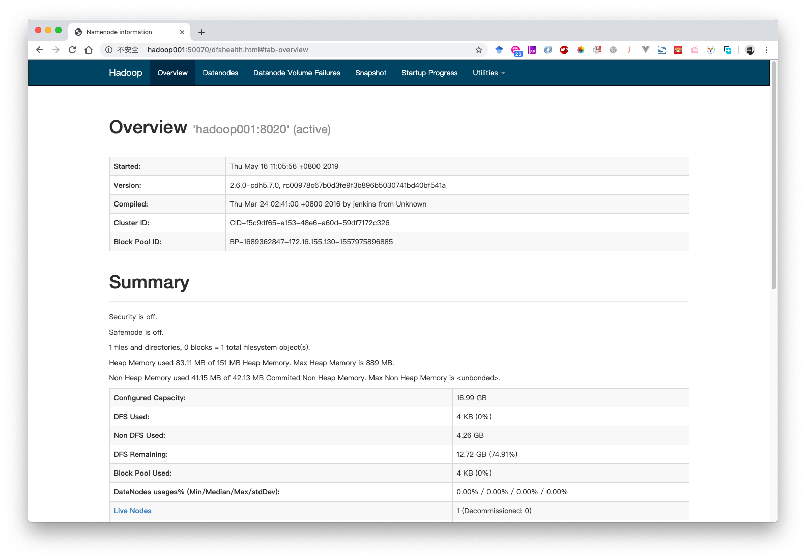

### 系统准备

新建文件：
/home/hadoop

- software ：存放软件安装包
- app : 存放软件目录
- data ： 存放测试数据
- source ： 存放软件源码：spark

### 下载Hadoop

下载地址：http://archive.cloudera.com/cdh5/cdh/5/

下载版本：2.6.0-cdh5.7.0

```shell
wget http://archive.cloudera.com/cdh5/cdh/5/hadoop-2.6.0-cdh5.7.0.tar.gz
```

### 配置环境和Hadoop

去官网  hadoop.apache.org 查看安装手册

1. 安装JDK

``` shell
export JAVA_HOME=[jdk]
export PATH=$JAVA_HOME/bin:$PATH
```

2. 机器参数设置

```shell
vim /etc/sysconfig/network

NETWORKING=yes
HOSTNAME=hadoop001

vim /etc/hosts

127.0.0.1 localhost
[ip] hadoop001
```

3. SSH免密码登录

```shell
ssh-keygen -t rsa
cp /root/.ssh/id_rsa.pub ~/.ssh/authorized_keys
```

4. 修改hadoop-env.sh

```shell
cd /root/hadoop/app/hadoop-2.6.0-cdh5.7.0/etc/hadoop
vim hadoop-env.sh

修改
export JAVA_HOME=/usr/lib/jvm/java-1.8.0-openjdk-1.8.0.212.b04-0.el7_6.x86_64
```

5. 修改core-site.xml

```shell
cd /root/hadoop/app/hadoop-2.6.0-cdh5.7.0/etc/hadoop
vim core-site.xml
```

添加

```xml
<configuration>
    <property>
        <name>fs.defaultFS</name>
        <value>hdfs://hadoop001:8020</value>
    </property>
    <property>
        <name>hadoop.tmp.dir</name>
        <value>/root/hadoop/temp</value>
    </property>
</configuration>
```

6. 修改hdfs-site.xml

```shell
cd /root/hadoop/app/hadoop-2.6.0-cdh5.7.0/etc/hadoop
vim hdfs-site.xml
```

添加

```xml
<property>
    <name>dfs.replication</name>
    <value>1</value>
</property>
```

### 启动Hadoop

1. 第一次启动：格式化HDFS

```shell
bin/hdfs namenode -format
```

2. 启动HDFS

```shell
sbin/start-dfs.sh
```

### 验证Hadoop

在浏览器中输入IP:50070，如果能访问到Hadoop后端，则启动成功：

