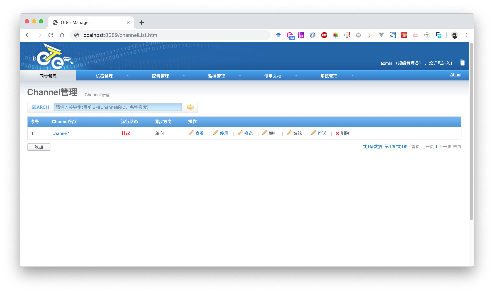
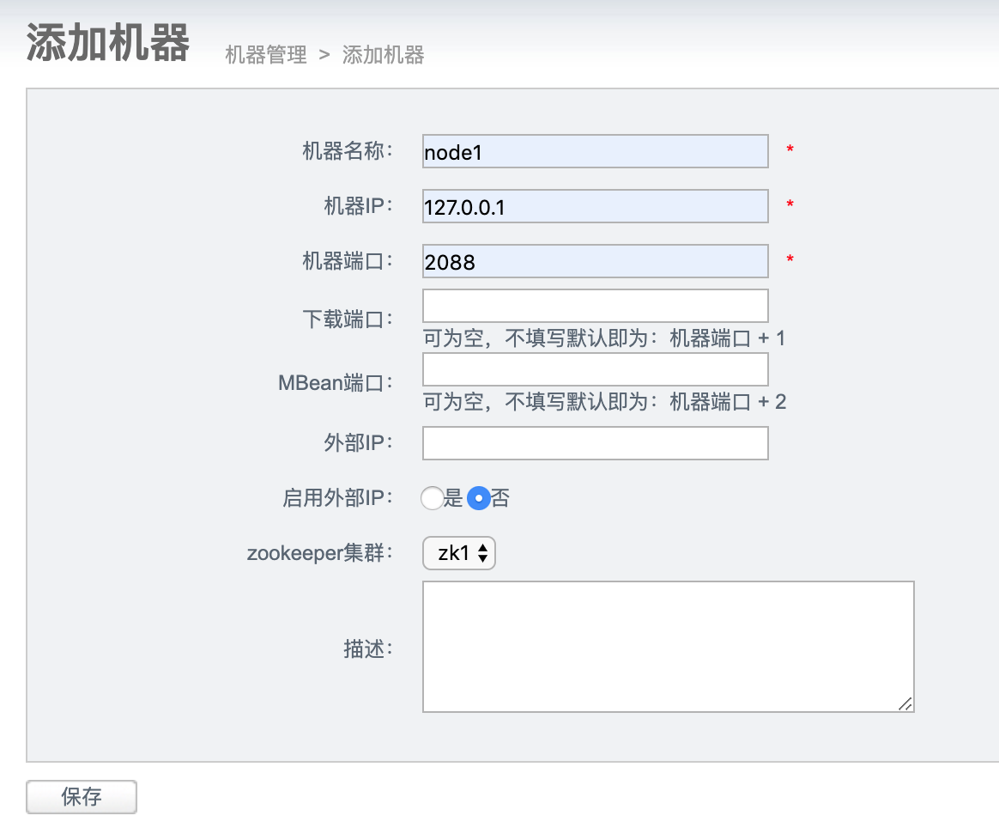
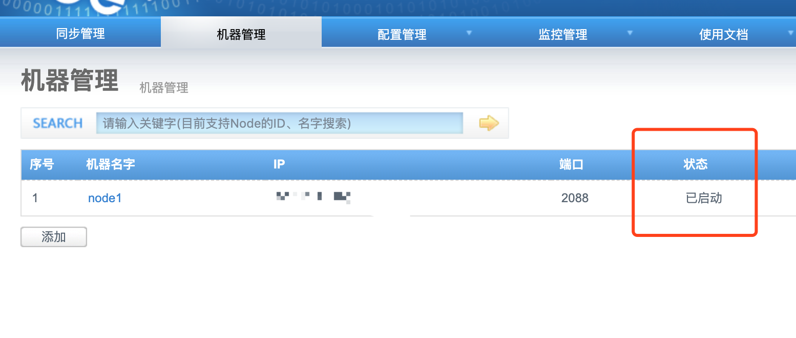

上一篇文章我们实现了RocketMQ的输出：

《改造阿里巴巴otter框架，使其支持RocketMQ配置和输出（二）》：[快速链接](/2019/05/20/改造阿里巴巴otter框架，使其支持RocketMQ配置和输出（二）/)

这篇我们将改造后的代码进行编译和部署，随后进行测试。

# 打包

otter已经把打包的shell脚本写好了，查看目录`docker/build.sh`

```shell
#!/bin/bash
# 省略不相关命令...
else 
    rm -rf $BASE/node.*.tar.gz ; 
    rm -rf $BASE/manager.*.tar.gz ; 
    cd $BASE/../ && mvn clean package -Dmaven.test.skip -Denv=release && cd $current_path ;
    cp $BASE/../target/node.deployer-*.tar.gz $BASE/
    cp $BASE/../target/manager.deployer-*.tar.gz $BASE/
#    docker build --no-cache -t canal/otter-all $BASE/
fi
```

将`docker build` 的语句注释，执行`sh docker.sh`即可进行打包，打包完成后会在当前目录下生成manager和node两个tar.gz，我们将其远程传输到服务器中：

```shell
scp manager.deployer-4.2.18-SNAPSHOT.tar.gz root@ip:~/otter
scp node.deployer-4.2.18-SNAPSHOT.tar.gz root@ip:~/otter
```

# 部署

进入部署服务器，使用tar解压：

```shell
cd ~/otter
mkdir manager
mkdir node
tar zxvf manager.deployer-4.2.18-SNAPSHOT.tar.gz -C manager
tar zxvf node.deployer-4.2.18-SNAPSHOT.tar.gz -C node
```

## 导入数据库文件

manager运行时需要依赖MySQL保存配置信息，根据文档[Manager_Quickstart](https://github.com/alibaba/otter/wiki/Manager_Quickstart)我们需要下载ddl文件进行数据库部署：

```shell
wget https://raw.github.com/alibaba/otter/master/manager/deployer/src/main/resources/sql/otter-manager-schema.sql 
mysql -h localhost -uroot -p
```

执行DDL：

```mysql
mysql > create database otter;
mysql > use otter;
mysql > source /root/otter/otter-manager-schema.sql;
mysql > exit;
```

## 部署manager

进入manager目录，修改`conf/otter.properties`文件，填写必须的参数：

```properties
## otter manager domain name
otter.domainName = 127.0.0.1
## otter manager http port
otter.port = 8080
## otter manager database config
otter.database.driver.class.name = com.mysql.jdbc.Driver
otter.database.driver.url = jdbc:mysql://127.0.0.1:3306/otter
otter.database.driver.username = root
otter.database.driver.password = root
...
```

保存后，执行部署

```shell
sh ./bin/startup.sh
```

打开浏览器，输入`ip:8080`，查看是否可以看到otter管理后台：



> 日志可以在`manager/logs/manager.log`中查看，管理员默认的账号密码为`admin:admin`，记得修改密码，不然有安全隐患。

### 配置Zookeeper

打开manager管理后台，以管理员账号登录，点击`机器管理`-`Zookeeper管理`，点击`添加`，输入集群信息，点击保存。这部必须执行，之后部署Node需要用到。

## 部署Node

打开manager管理后台，以管理员账号登录，点击`机器管理`-`Node管理`，点击`添加`，输入Node相关信息：



点击保存，可以得到保存好的Node节点，且状态为未启动：


复制`序号`列下的内容，图中为1。打开服务器后台，进入目录`node`

```shell
cd ~/otter/node
echo 1 > conf/nid
```

这样就表示这个Node是为了上图这个Node而配置的，然后启动Node：

```shell
./bin/startup.sh
```

刷新后台，可以看到Node状态为`已启动`



到此为止，我们的Manager和Node已经部署完毕。

