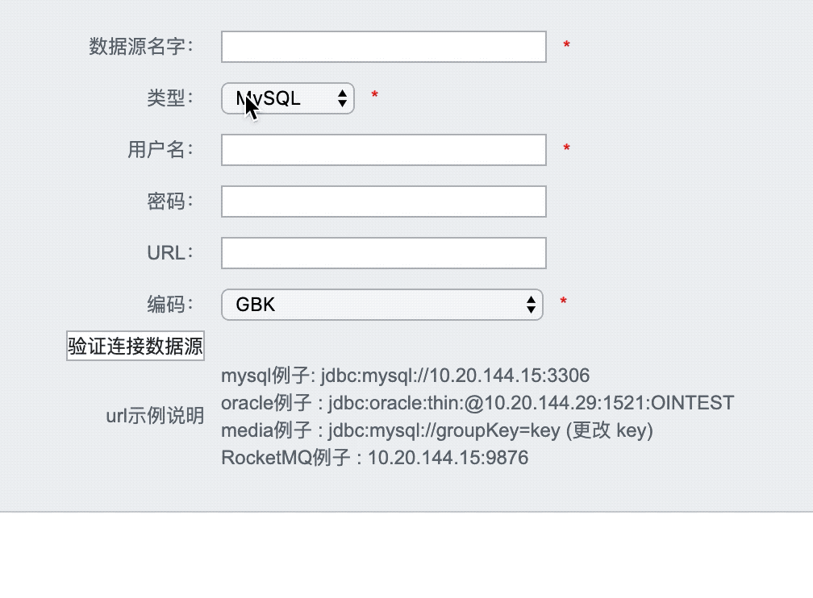

# 改造清单

1. 定义RocketMQ实体，定义一个RocketMQ的目标源。
2. 改造管理系统的逻辑以及前端，支持RocketMQ的配置。
3. 改造Transerformer模块，支持将数据转换成RocketMQ需要的格式。
4. 改造Load模块，支持将数据向RocketMQ发送。

# 定义RocketMQ

otter 中定义一个数据源是由`DataMediaSource`决定的。

```java
public class DataMediaSource implements Serializable {
    private Long              id;
    private String            name;
    private DataMediaType     type;
    private String            encode;
    private Date              gmtCreate;
    private Date              gmtModified;
  	// get and set...
}
```

查看这个表的继承类，可以看到`DbMediaSource`，定义了`url`、`username`、`password`、`driver`等连接数据库必须要的参数。于是我就照着他的实现方式来进行编写支持RocketMQ的新实现。

## RocketMQMediaSource

编写类`RocketMQMediaSource`，定义连接到RocketMQ的必要参数：

```java
public class RocketMqMediaSource extends DataMediaSource {
  	// 定义连接到RocketMQ的gourpName
    private String            groupName;
  	// 定义连接到RocketMQ的namesrvAddr
    private String            namesrvAddr;
  	// get and set...
}
```

同时，在枚举类`DataMediaType`添加名称为`ROCKETMQ`的枚举。


## RocketMQDataMedia

实现DataMedia类`DataMedia<Source extends DataMediaSource>`，泛型定义为`RocketMQMediaSource`

```java
public class RocketMqDataMedia extends DataMedia<RocketMQMediaSource> {}
```

此类定义了一种数据媒介为RocketMQ。

# 改造管理系统

## 添加数据源页面

打开`addDataSource.vm`可以看到添加数据源的前端代码，此代码是由**模板引擎velocity**编写的，Java会根据指定的格式渲染HTML页面展示给客户端。找到数据源下拉框Select，添加RocketMQ选项。

```html
<td>
  <select id="sourceType" name="$dataMediaSourceGroup.type.key" onchange="changeform();" >
    <option value="MYSQL">MySQL</option>
    <option value="ORACLE">Oracle</option>
    <option value="ROCKETMQ">RocketMQ</option>   <!--添加一行，提供RocketMQ的选择-->
  </select><span class="red">*</span>
</td>
```

对于sourceType这个参数，后端可以识别为枚举类`DataMediaType.ROCKETMQ`，所以后端可以不需要修改其他的地方。

但是RocketMQ还需要填写额外的参数`gourpName`，我们需要对前端进行一定的改造，由于作者在这里预留了`changeFrom()`函数，触发条件为`select`下拉框被改变的时候，那么我们就可以判断当其改变时，作出相应的表单内容调整。

首先我们定义需要填写的groupName：

```html
<tr id="group_name_tr" style="display: none;">  <!-- 注意第一行，很重要 -->
  <th>GroupName：</th>
  <td>
    <input id="sourceGroupName" name="$dataMediaSourceGroup.groupName.key" value="$!dataMediaSourceGroup.groupName.value" type="text" class="setting_input"/><span class="red">*</span>
    <br />
    <span class="red">#addDataSourceMessage ($dataMediaSourceGroup.groupName)</span>
  </td>
</tr>
```

重写`changeForm()`函数：

```javascript
function changeform() {
    console.log("changed form")
  	//获取 sourceType 的Dom对象
    var sourceType = document.getElementById('sourceType').value;
  	//获取 groupName 的Dom对象
    var group_name_tr = document.getElementById("group_name_tr");
    if ("ROCKETMQ" === sourceType) {
      	// 如果是RocketMQ，则显示 groupName 的填写框
        group_name_tr.style.display = "table-row";
    } else {
      	// 否则不显示
        group_name_tr.style.display = "none";
    }
}
```

这样我们就可以根据下拉框自动展示需要填写的表单了：


