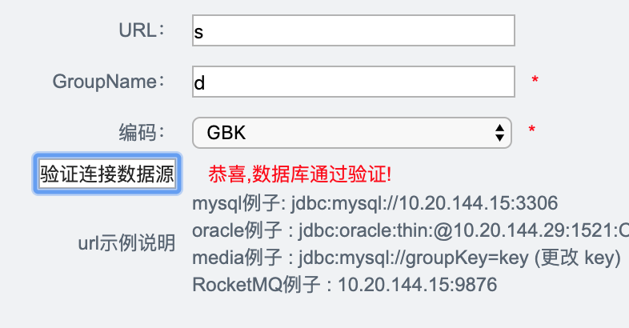
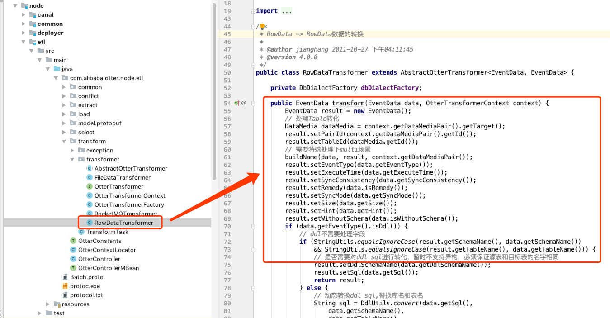

上篇文章我们分析了Otter的代码结构：

《改造阿里巴巴otter框架，使其支持RocketMQ配置和输出（一）》：[快速链接](/2019/05/15/改造阿里巴巴otter框架，使其支持RocketMQ配置和输出（一）/)

这篇我们开始正式进行改造。

# 改造清单

1. 定义RocketMQ实体，定义一个RocketMQ的目标源。
2. 改造管理系统的逻辑以及前端，支持RocketMQ的配置。
3. 改造Transerformer模块，支持将数据转换成RocketMQ需要的格式。
4. 改造Load模块，支持将数据向RocketMQ发送。


# 定义RocketMQ

otter 中定义一个数据源是由`DataMediaSource`决定的。

```java
public class DataMediaSource implements Serializable {
    private Long              id;
    private String            name;
    private DataMediaType     type;
    private String            encode;
    private Date              gmtCreate;
    private Date              gmtModified;
    // get and set...
}
```

查看这个表的继承类，可以看到`DbMediaSource`，定义了`url`、`username`、`password`、`driver`等连接数据库必须要的参数。于是我就照着他的实现方式来进行编写支持RocketMQ的新实现。

## RocketMQMediaSource

编写类`RocketMQMediaSource`，定义连接到RocketMQ的必要参数：

```java
public class RocketMqMediaSource extends DataMediaSource {
    // 定义连接到RocketMQ的gourpName
    private String            groupName;
    // 定义连接到RocketMQ的namesrvAddr
    private String            namesrvAddr;
    // get and set...
}
```

同时，在枚举类`DataMediaType`添加名称为`ROCKETMQ`的枚举。


## RocketMQDataMedia

实现DataMedia类`DataMedia<Source extends DataMediaSource>`，泛型定义为`RocketMQMediaSource`

```java
public class RocketMqDataMedia extends DataMedia<RocketMQMediaSource> {}
```

此类定义了一种数据媒介为RocketMQ。

# 改造管理系统

## 添加数据源页面

打开`addDataSource.vm`可以看到添加数据源的前端代码，此代码是由**模板引擎velocity**编写的，Java会根据指定的格式渲染HTML页面展示给客户端。找到数据源下拉框Select，添加RocketMQ选项。

```html
<td>
  <select id="sourceType" name="$dataMediaSourceGroup.type.key" onchange="changeform();" >
    <option value="MYSQL">MySQL</option>
    <option value="ORACLE">Oracle</option>
    <option value="ROCKETMQ">RocketMQ</option>   <!--添加一行，提供RocketMQ的选择-->
  </select><span class="red">*</span>
</td>
```

对于sourceType这个参数，后端可以识别为枚举类`DataMediaType.ROCKETMQ`，所以后端可以不需要修改其他的地方。

但是RocketMQ还需要填写额外的参数`gourpName`，我们需要对前端进行一定的改造，由于作者在这里预留了`changeFrom()`函数，触发条件为`select`下拉框被改变的时候，那么我们就可以判断当其改变时，作出相应的表单内容调整。

首先我们定义需要填写的groupName：

```html
<tr id="group_name_tr" style="display: none;">  <!-- 注意第一行，很重要 -->
  <th>GroupName：</th>
  <td>
    <input id="sourceGroupName" name="$dataMediaSourceGroup.groupName.key" value="$!dataMediaSourceGroup.groupName.value" type="text" class="setting_input"/><span class="red">*</span>
    <br />
    <span class="red">#addDataSourceMessage ($dataMediaSourceGroup.groupName)</span>
  </td>
</tr>
```

重写`changeForm()`函数：

```javascript
function changeform() {
    console.log("changed form")
    //获取 sourceType 的Dom对象
    var sourceType = document.getElementById('sourceType').value;
    //获取 groupName 的Dom对象
    var group_name_tr = document.getElementById("group_name_tr");
    if ("ROCKETMQ" === sourceType) {
        // 如果是RocketMQ，则显示 groupName 的填写框
        group_name_tr.style.display = "table-row";
    } else {
        // 否则不显示
        group_name_tr.style.display = "none";
    }
}
```

这样我们就可以根据下拉框自动展示需要填写的表单了：


## 验证连接数据源改造

同时，需要将验证连接数据源，这个按钮所请求的后端逻辑进行改造，否则无法通过提交：



根据DEBUG我们得知，该验证逻辑定义在`DataSourceChecker`类的check()方法中，所以我们对该方法进行改造：

```java
public String check(String url, String username, String password, String encode, String sourceType, String groupName) {
  if ("MYSQL".equalsIgnoreCase(sourceType) || "ORACLE".equalsIgnoreCase(sourceType)) {
    return checkDB(url, username, password, encode, sourceType);
  } else if ("RocketMQ".equalsIgnoreCase(sourceType)) {
    return checkMQ(url, username, password, encode, sourceType, groupName);
  } else {
    return DATABASE_SUCCESS;
  }
}
```

改造后，系统可以根据入参sourceType执行不同的验证逻辑。对于RocketMQ的验证逻辑目前我只是将连接打开再关闭，如果没有报错则返回成功，但是目前看下来，好像这个逻辑并不严谨，希望讨论获得更好的方案：

```java
private String checkMQ(String url, String username, String password, String encode, String sourceType, String groupName) {
  DefaultMQProducer defaultMQProducer =new DefaultMQProducerImpl(groupName);
  defaultMQProducer.setNamesrvAddr(url);
  try {
    defaultMQProducer.start();
    return DATABASE_SUCCESS;
  } catch (MQClientException e) {
    logger.error("connect to RocketMQ failed", e);
    return DATABASE_FAIL;
  } finally {
    defaultMQProducer.shutdown();
  }
}
```

# 实现RocketMQTransformer

Otter对从Canal拉取到的数据进行了四步处理，分别是：Select、Extract、Transform、Load。

对于新的输出来说，只需要改造Transformer和Load即可。

查看源代码，找到node模块下的包`com.alibaba.otter.node.etl.transform`，可以看到基于MySQL和Oracle的实现：



该实现继承自类`com.alibaba.otter.node.etl.transform.transformer.OtterTransformer`：

```java
public interface OtterTransformer<S, T> {
    S transform(T data, OtterTransformerContext context);
}
```

所以我们只需要实现该接口即可：

```java
public class RocketMQTransformer implements OtterTransformer<EventData, EventData> {
    @Override
    public EventData transform(EventData data, OtterTransformerContext context) {
        List<CanalEntry.Column> beforeColumns = data.getBeforeColumns();
        List<CanalEntry.Column> afterColumns = data.getAfterColumns();

        HashMap<String, Object> before = new HashMap<String, Object>();
        HashMap<String, Object> after = new HashMap<String, Object>();

        for (CanalEntry.Column column : beforeColumns) {
            before.put(column.getName(), column.getValue());
        }
        for (CanalEntry.Column column : afterColumns) {
            after.put(column.getName(), column.getValue());
        }

        data.setAfter(after);
        data.setBefore(before);
        data.setAfterColumns(null);
        data.setBeforeColumns(null);
        if (data.getKeys().size() > 0) {
            data.setPrimaryKey(data.getKeys().get(0).getColumnValue());
        }
        return data;
    }
}
```

`RocketMQTransformer`是`OtterTransformer`的RocketMQ版本实现，主要是根据使用方的需求进行数据的整理封装，返回合理的数据。这里我们将每个字段的改变前和改变后作为值存入数据集。

# 实现RocketMQLoader

实现Loader也是相同的，找到Loader接口`com.alibaba.otter.node.etl.load.loader.OtterLoader`：

```java
public interface OtterLoader<P, R> {
    R load(P data);
}
```

进行实现：

```java
public class RocketMQLoader implements OtterLoader<DbBatch, List<LoadContext>>, BeanFactoryAware {
    private BeanFactory         beanFactory;

    @Override
    public List<LoadContext> load(DbBatch data) {
        // 发送MQ方法省略
        return sendToRocketMQ(data);
    }

    @Override
    public void setBeanFactory(BeanFactory beanFactory) throws BeansException {
        this.beanFactory = beanFactory;
    }
}
```

由于篇幅限制，我省略了一些实现，包括管道配置、RocketMQClient工具类编写。

更多代码请参考我Fork出来的github项目：[https://github.com/lzx2005/otter](https://github.com/lzx2005/otter)，我修改的代码在分支`mq-extend-try-1`中。

接下来的第三篇文章就是对我们新改造的模块进行各方面的压测，确保其可以继承Otter优秀的性能，同时也能完美做到组件扩展。

未完待续。